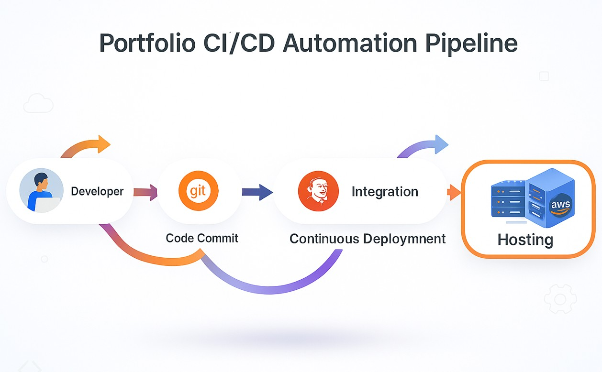
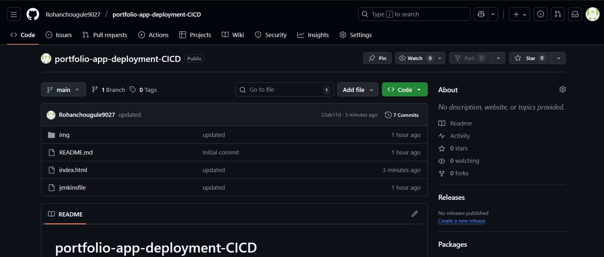
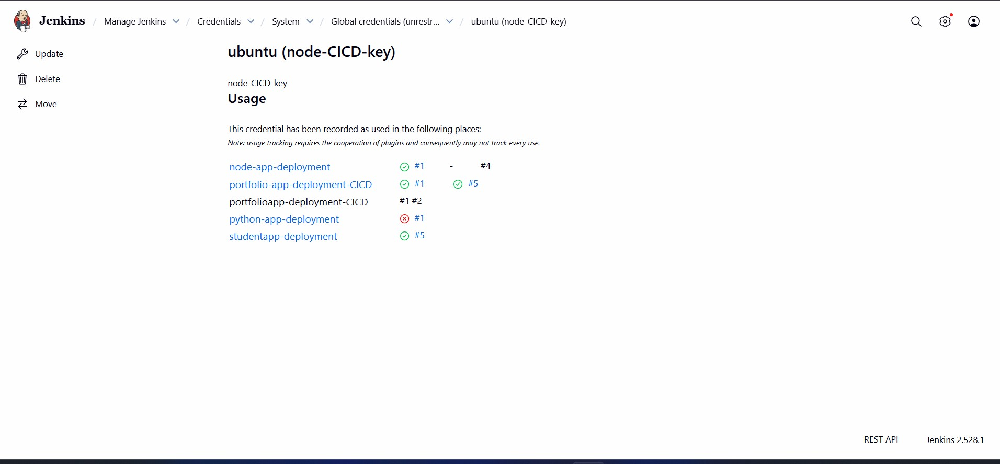
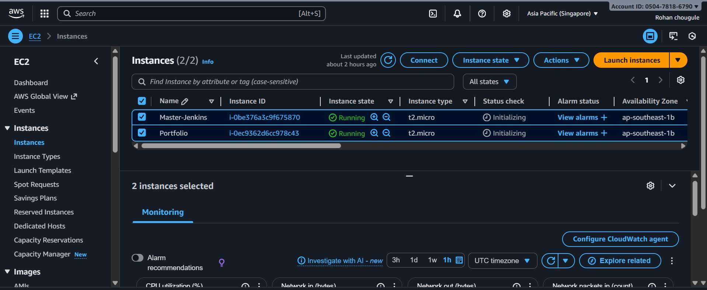
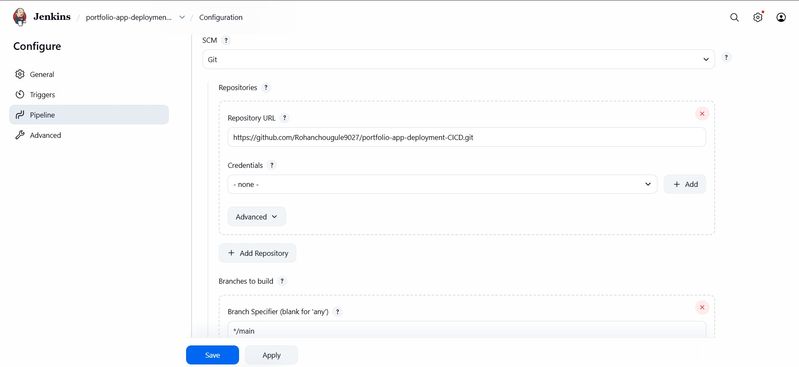
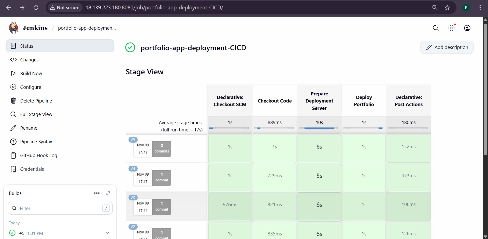
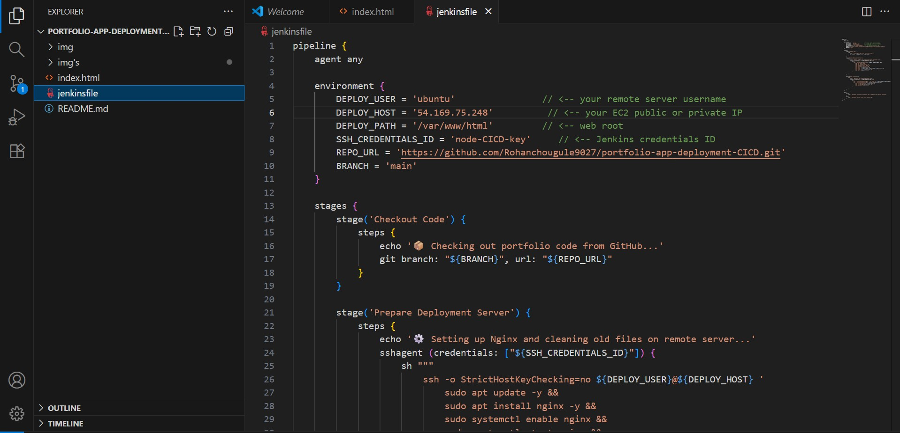
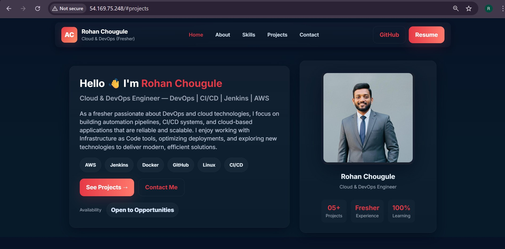
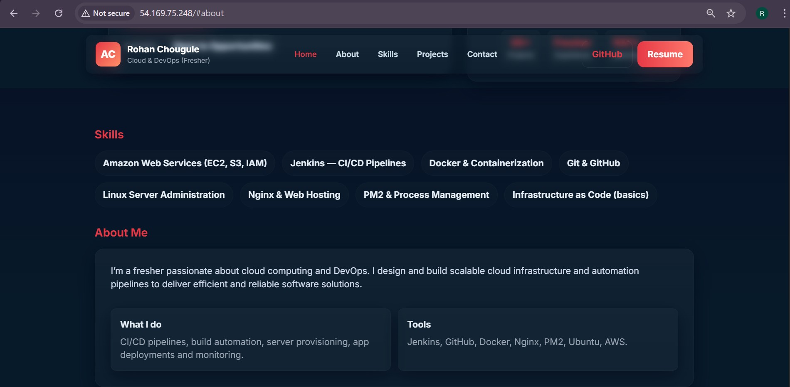

# 🌐 Portfolio Website — CI/CD Automation (DevOps Project)
Rohan Chougule - Portfolio

### 🚀 Overview
This project demonstrates complete CI/CD automation of a personal Portfolio Website using Git, GitHub, Jenkins, AWS EC2, and Nginx.
The main goal of this project is to host a static portfolio webpage automatically on an EC2 instance whenever new code is pushed to GitHub.
### ⚡ Architecture Diagram


<!DOCTYPE html>
<html lang="en">
<head>
  <meta charset="UTF-8">
  <meta name="viewport" content="width=device-width, initial-scale=1.0">
</head>
<body>
  <h2>🧩 Tech Stack</h2>
  <table border="1" cellpadding="8" cellspacing="0">
    <thead>
      <tr>
        <th>Tool/Service</th>
        <th>Purpose</th>
      </tr>
    </thead>
    <tbody>
      <tr>
        <td>Git</td>
        <td>Source code tracking</td>
      </tr>
      <tr>
        <td>GitHub</td>
        <td>Cloud repository + Webhooks</td>
      </tr>
      <tr>
        <td>Jenkins</td>
        <td>CI/CD Pipeline Automation</td>
      </tr>
      <tr>
        <td>AWS EC2 (Ubuntu)</td>
        <td>Web Hosting Server</td>
      </tr>
      <tr>
        <td>Nginx</td>
        <td>Static website hosting</td>
      </tr>
      <tr>
        <td>SSH Key Authentication</td>
        <td>Secure deployment</td>
      </tr>
    </tbody>
  </table>
</body>
</html>

### 🔁 Workflow Summary   
✅ Developer pushes code → GitHub
✅ Jenkins automatically pulls latest code
✅ Nginx server auto-deploys new version
✅ Site updated instantly with no manual steps

### ⚙️Project Workflow – Step by Step Explanation   
✅ 1️⃣ Development – Local System
* Static Portfolio Website using HTML + CSS
* Verified via VS Code Live Server
```
PORTFOLIO-APP-CI-CD/
│── index.html
│── css/
│── images/
│── Jenkinsfile
```
### ✅ 1. Create GitHub Repo
Create a repository on Github Name: `portfolio-app-deployment-CICD` Branch: `main`



### 🧰 2. Initialize Git and Push Code to GitHub
sed Git to version control and push code to GitHub.
```
git init
git add .
git commit -m "Initial portfolio upload"
git branch -M main
git remote add origin https://github.com/Rohanchougule9027/portfolio-app-deployment-CICD.git
git push -u origin main
```

✅ After this, the complete project (HTML, CSS, images, Jenkinsfile) is available publicly on GitHub. 👉 GitHub Repository

---

### ✅ 3. Jenkins Credentials
Manage Jenkins → Credentials → System → Global:                     
* Create New Credentails
  *  Scope: `Global`
  * id: `node-CICD-key`
  * description: `node-CICD-key`
  * username: `ubuntu`
  * private key: `Your-Private-Key` 
  


### ✅ 4. Setup Portfolio EC2 (Srver 2)
*  Launch a new Ubuntu EC2 instance for portfolio hosting.
* Open inbound port 80 (HTTP) in AWS Security Group.
* Jenkins pipeline will handle Nginx installation automatically.



---
### 🔁 5. Jenkins Pipeline Configuration
In Jenkins Dashboard:
  * Create a new Pipeline Project → `portfolio-app-deployment`
  * Select `“Pipeline Script from SCM”`
  * SCM: `Git`
  * Repo URL:`https://github.com/Rohanchougule9027/portfolio-app-deployment-CICD.git`
  * Branch: `main`
  * Script Path: `jenkinsfile`





### 🧾 Jenkinsfile (CI/CD Pipeline Script)



### 🌍 Live Deployment
🚧 Deployment ready on AWS EC2 – Coming soon!





### ✅ Key Highlights
* Fully automated CI/CD using Jenkins
* Zero manual deployment — push → auto-update
* Secure & scalable AWS setup
* Separate Jenkins and Deployment EC2 servers
* Nginx as production-grade static web host

### 🏁 Conclusion :
As a dedicated Cloud & DevOps Enthusiast, I am continuously learning modern tools and technologies to improve automation, scalability, and efficient deployment. I am eager to contribute my skills to real-world projects and grow into a highly skilled Cloud & DevOps professional.

